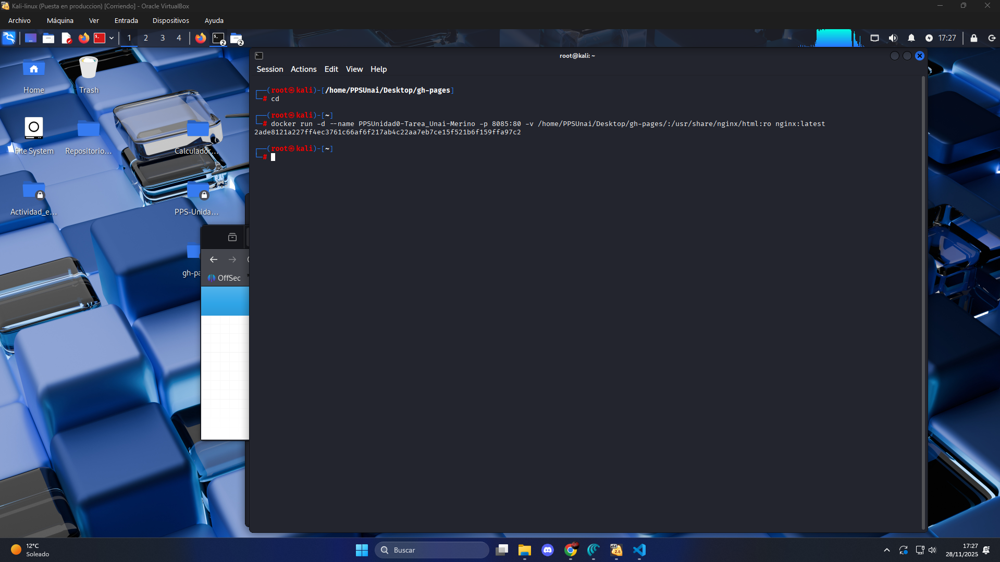

# Docker
## (Creación y despliegue de documentación mediante contenedor ngynx)


Para este apartado ya dispondremos del contenido estático que MkDocs ha generado en gh-pages y lo montaremos en un contenedor NGINX, mediante el puerto 8085.​

---

## Paso 1: Preparar la carpeta estática (rama gh-pages)
En nuestra máquina anfitriona, clonaremos el repo con la rama gh-pages.

`git clone git@github.com:vjp-unaiMB/PPS-Unidad0-TareaRA5-Unai-Merino-Bara-ano.git gh-pages`


* Como todavía seguimos en la rama main, seguiremos viendo el mismo contenido que en el repositorio original. Antes de cambiar de rama, vamos a configurarlo como repositorio seguro para que no nos de problemas de autenticidad.
`git config --global --add safe.directory /home/PPSUnai/Desktop/gh-pages`

* Posteriormente, cambiamos de rama mediante checkout. `git checkout -b gh-pages origin/gh-pages`


Usaremos esta nueva carpeta con los archivos ya visibles de la rama gh-pages para el bind‑mount.

---

## Paso2: Crear el contenedor NGINX.

Para la creación de nuestro contenedor ejecutaremos un comando Docker RUN en el que configuraremos el ***nombre***, el ***puerto 8085*** , un ***binmound*** con nuestra carpeta e indincamos también que usaremos una imágen de Nginx en su última versión.

NGINX sirve estáticos desde /usr/share/nginx/html dentro del contenedor, allí montremos nuestra carpeta con el sitio de MkDocs.​

```
docker run -d 
  --name PPSUnidad0-Tarea_Unai-Merino 
  -p 8085:80 
  -v /ruta/absoluta/a/gh-pages:/usr/share/nginx/html:ro 
  nginx:latest
```



---

## RESULTADO FINAL:

Observamos que se ha desplegado correctamente accediendo mediante el puerto en el naveador.

