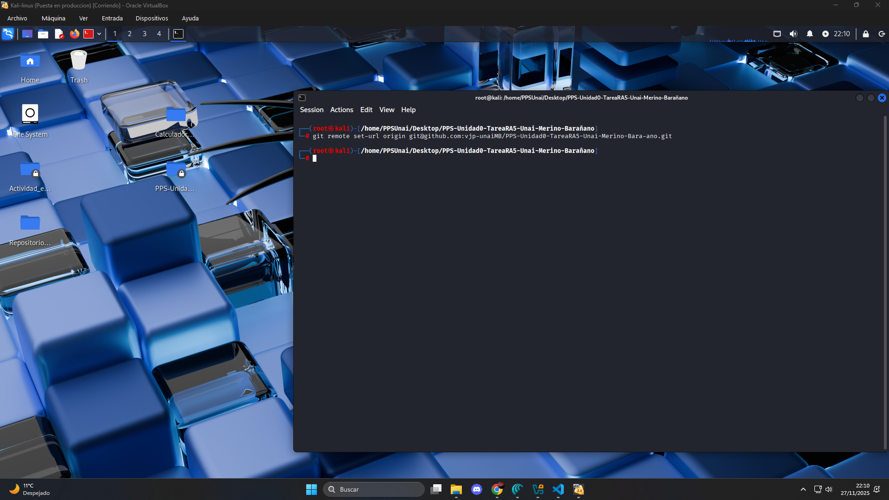

# Git
## (Creación de repositorios)

Para la creación de neustro repositorio GIT de esta actividad seguiremos los siguientes pasos:

## Paso 0: Reubicación.

Para comenzar esta tarea es importante ubicarse y saber lo que haremos de allí en adelante. 

Estando dentro de la máquina kali, comenzaremos la actividad creando una nueva carpeta que llamaremos: `PPS-Unidad0-TareaRA5-Unai-Merino-Barañano`

Dentro de esta carpeta organizaremos nuestros archivos y alojaremos el repositorio de GIT local de este proyecto.


## Paso 1: Reutilización de material.

Copiaremos en el nuevo directorio algunos archivos del repositorio local de la actividad anterior *DevSecOps* quedándonos con la carpeta `/calculadora` y junto a ella otra carpeta `/docs` vacía.


De momento la estructura de nuestro directorio corresponde a:

```
PPS-Unidad0-TareaRA5-Unai-Merino-Barañano
├── calculator/  
│   ├── __init__.py  
│   └── gui.py  
└──  docs/  
```

## Paso 2: Inicialización de repositorio local.

> **¡IMPORTANTE!** Al tener ya listas nuestras variables de entorno de configuración de git no las crearemos ni haremos mención de ellas.


Abriremos un terminal en Root y accederemos a la carpeta, desde donde ejecutaremos los siguientes comandos para:

1. Acceder a la carpeta `cd /home/PPSUnai/Desktop/PPS-Unidad0-TareaRA5-Unai-Merino-Barañano/`
1. Crear repo local `git config --global init.defaultBranch main
`
1. Inicializar Git `git init`


Estructura del proyecto:

```
PPS-Unidad0-TareaRA5-Unai-Merino-Barañano
├── calculator/  
│   ├── __init__.py  
│   └── gui.py  
├── docs/   
└── .git
```

## Paso 3: Creación y vinculación con Repositorio Remoto.

Como hemos empezado nuestro proyecto en un repositorio local, no disponemos de repositorio remoto, por lo que en este apartado lo crearemos en github para posteriormente vincularlo a nuestro repositorio local.

`Inicio > Nuevo > NombreRepo > CrearRepo`


Añadimos colaboradores: `Tras crearlo > AddCollaborators > AddPeople`


Vinculamos los repositorios remoto y local mediante una ***KEY SSH**, para ello apuntaremos hacia nuestro Repositorio Remoto con la siguiente sentencia: 

`git remote set-url origin git@github.com:vjp-unaiMB/PPS-Unidad0-TareaRA5-Unai-Merino-Bara-ano.git
`



## Paso 4: Primer Commit.

Crearemos un primer commit agregando a nuestro directorio una primera versión de la carpeta docs imcompleta pero que irá completandose a medida de que se vaya construyendo cada apartado restante de esta actividad.

