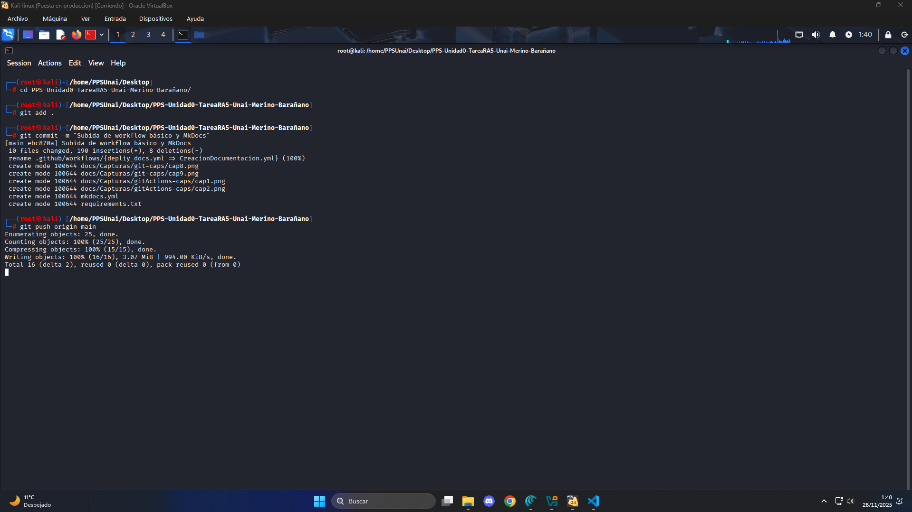

# GitActions
## (Workflow & MkDocs)

En este apartado añadiremos funcionalidad a nuestro proyecto mediante la configuración de MkDocs y Workflow.

---

## Paso 1: MkDocs

En este paso agregaremos a nuestro proyecto el fichero `mkdocs.yml` y lo configuraremos para que sirva nuestra documentación.

* Creamos el fichero ***hijo directo del directorio principal*** `nano mkdocs.yml`
* Rellenamos el fichero:

En este caso debemos de modificar la variable `site_name` y el listado de secciones `nav`, añadiendo un apartado por documento creado en ***/docs***.


---

## Paso 2: Workflow

Nuestro archivo workflow nos permitirá ejecutar una serie de instrucciones al poner en servicio nuestro proyecto, en este caso cada vez que hacemos push, para configurarlo seguiremos los siguientes pasos:

* Creamos la raíz de directorios necesarios  `mkdir -p .github/workflows`

* Dentro de la carpeta workflows creamos guardamos el siguiente archivo de configuración para pipeline: `nano /.github/workflows/CreacionDocumentacion.yml`

Este archivo se encargará de construir y ejecutar una serie de instrucciones por cada push creado en la rama gh-pages haciendo así que el proyecto de despliegue. 

> Usaremos el del ejercicio anterior.


---

## Paso 3: Confirmar, commitear y hacer push

Una vez aplicados los cambios subimos el contenido al Repositorio Remoto con la secuencia que acostumbramos a hacer.

* Aplicamos los cambios `git add .`
* Creamos el Commit `git commit -m "Subida de workflow básico y MkDocs"`

* Hacemos push `git push origin main`



Se debería de ver el workflow ejecutándose en el último push.

---

## RESULTADO FINAL:

***Repositorio Remoto:***


***Estructura final:***

```
PPS-Unidad0-TareaRA5-Unai-Merino-Barañano/
├── calculator
│   ├── __init__.py
│   └── gui.py
├── docs
│   ├── Capturas
│   │   └── ...
│   ├── conclusiones.md
│   ├── docker.md
│   ├── git.md
│   ├── gitActions.md
│   ├── gitPages.md
│   └── index.md
├── mkdocs.yml
├── requirements.txt  
└── .github
    └── workflows
        └── CreacionDocumentacion.yml

```