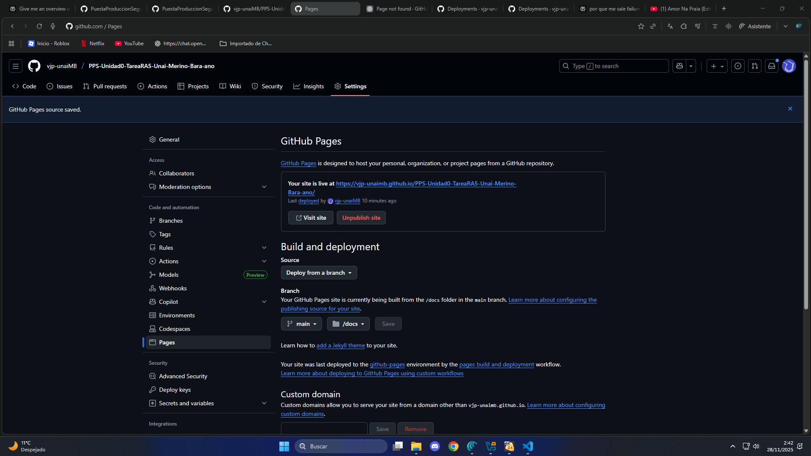
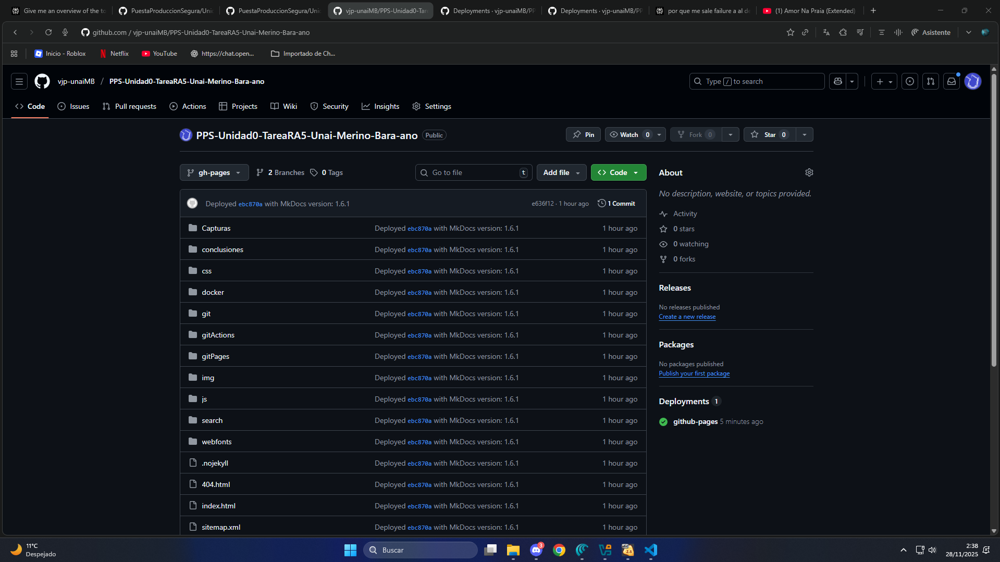
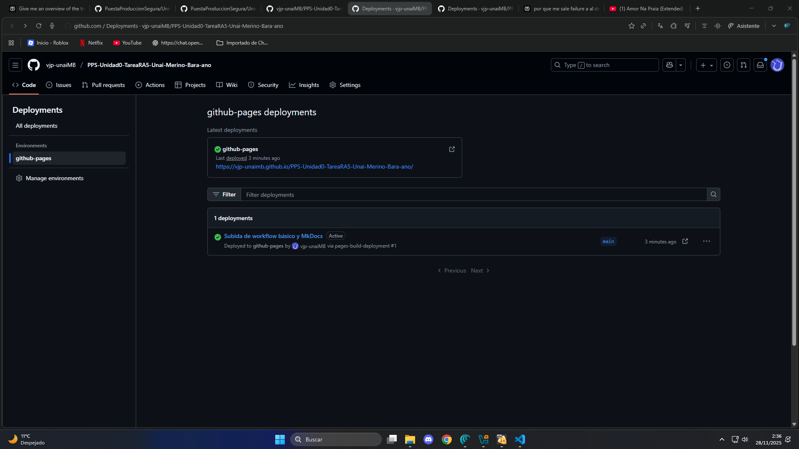

# GitPages
## (Despliegue de la documentación con GitHub)

En este apartado explicaremos los pasos a seguir en nuestro Repositorio Remoto para configurar el despliegue de nuestro proyecto en el Repositorio Remoto.

Hay que recordar que hemos configurado neustros archivos para que se despliegue nada más hacer un push por lo que comprobaremos también si se ha llevado a cabo.

## Paso 1: Estado del espliegue

Partimos desde la vista general de neustro repositorio en GitHub y nos dirigiremos a la pesatalla acciones del índice superior.

`Code > Actions`

En esta vista nos aparecen nuestros push y podemos ver si son desplegables o no, vemos que a partir del segundo push al haber añadido el MkDocs y un archivo Workflow si es desplegable.

Al clickar en el segundo commit podemos ver una lista de logs organizada en secciones. Estos logs nos muestran las instrucciones ejecutadas que han llevado a cabo nuestros ficheros.

## Paso 2: Configuración de Páginas.

Antes de comprobar el resultado del despliegue hay que cambiar un par de configuraciones de nuestro repositorio. Para ello iremos a la vista de configuraión de páginas clickando en el ***icono del engranaje*** el índice superior, luego buscaremos en la lista izquierda la categoría ***Pages***. 

`Actions > Settings > Pages`

Una vez en el sitio sostituiremos 2 valores en la subcategoría ***Branch***.

* ***Primer cuadro*** -> cambiamos de `main` a `gh-pages` porque así se lo hemos indicado en el contenido del Workflow.

* ***Segundo cuadro*** -> cambiamos el directorio de padre de la documentaión `/(root)` .

## Paso 3: Ver Resultado

Volvemos a nuestra vista general del repositiorio `Code` y observamos que abajo a la derecha nos aparece un resultado en alc ategoía ***Deployments*** `github-pages`. Clickamos en él.

Nos aparecerá un recuadro con los últimos despliegues. Si pulsamos en el enlace nos enviará a nuestra página desplegada del proyecto.

